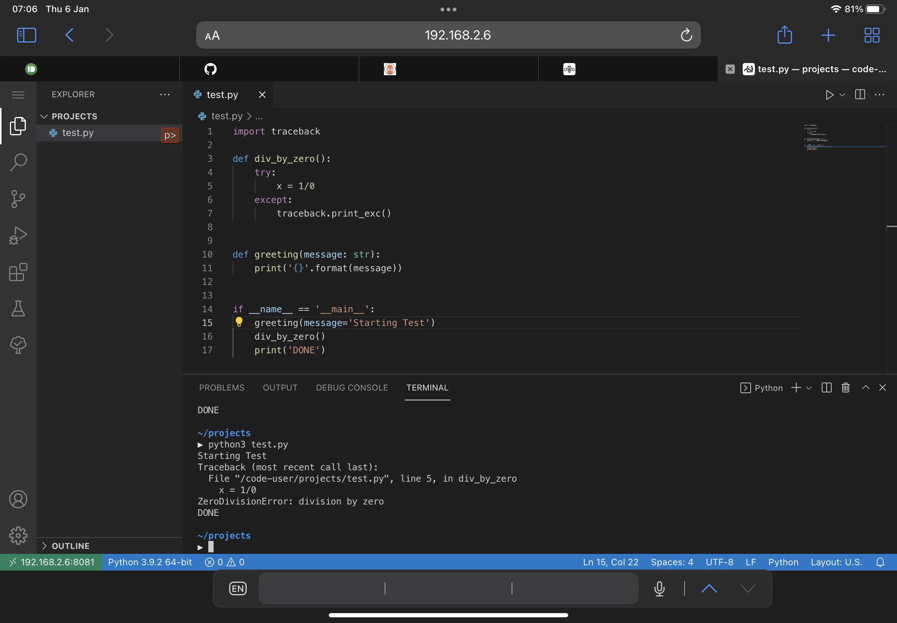

# code-container



The screenshot above shows a simple example from an Apple iPad Air 4 (2020) connected to the IDE on a LAN network.

The Docker container is based on a Debian container that hosts the project https://github.com/cdr/code-server

The latest updates (showing the last three months in which updates were done):


__Updates for February 2025__

* Bumped version to [code-server v4.96.4](https://github.com/coder/code-server/releases/tag/v4.96.4)
* NodeJS was bumped to version 22

__Updates for January 2025__

* Bumped version to [code-server v4.96.2](https://github.com/coder/code-server/releases/tag/v4.96.2)
* NodeJS was bumped to version 18
* Updated examples from using `docker` to `podman`
* Adapted the Dockerfile to reference base image from docker hub using a full URL compatible with `podman`


## Important Security Information

This project essentially packages a release from [another repository](https://github.com/cdr/code-server) for convenience. Please check the latest version in that repository and compare that with the version being built for this image. If you are not comfortable with any discrepancies, please do not use this image.

This solution assumes a private running environment and all authentication to the VSCode web interface have been disabled.


> [!IMPORTANT]
> Do not expose the running container directly to the Internet. This solution was intended for a PRIVATE and trusted networked environment.

HTTPS is not enabled. All network traffic is in the clear.

Telemetry and update checks have been disabled.

Commands below demonstrate how you can gain Terminal access to the running docker container. The image is based of Debian and you should therefore be able to use debian commands like `apt` if you need to install additional software. Just keep in mind that your packages will also be non-existent of you delete the container. A way to add additional packages on first run will be a feature I am considering - see the Feature Backlog at the end of this README.

My repositories are scanned by [Snyk](https://snyk.io/) and I will attempt to give attentions to issues as soon as possible, as and when they arise.

## Build

If you cloned this repository from GitHub, you can build the image with the following command:

```shell
podman build -t code-container .
```

To force a completely fresh build, try running:

```shell
podman build --no-cache -t code-container .
```

## Running the Container

### Preparing a persistent projects directory:

Below is an example of creating a directory where all your projects will live. Even if you delete the container and images, any files you created or projects you worked on will still be available here.

```shell
mkdir -p $HOME/tmp/test-projects
```

### Running a Custom Built Image:

```shell
podman run --name codeserve -d -p 127.0.0.1:8081:8081 -v $HOME/tmp/test-projects:/code-user/projects localhost/code-container:latest
```

The extensions first need to be installed, which can take a minute or so. You can check when the server is ready by tailing the logs with `podman logs -f codeserve`:

```text
Starting the code-server
  .
  .
  .
Installing extensions...
  .
  .
  .
[2021-03-12T06:42:56.920Z] info  HTTP server listening on http://0.0.0.0:8081
```

By the time you see the last line above, the server is pretty much up. There may very well be some additional output after that line - that is fine. Unless of course you observe an error in the output - that may be a problem.

### Other Considerations 

If you opt to use the persistent project directory, keep in mind that any solution specific files or directories should always be used from the VSCode IDE, since there may be incompatibilities from the perspective of your host system.

Examples of this include the creation of Python virtual environments or installing Node modules for a project. 

You may need a terminal in the running container to achieve these goals - refer to the sections below for getting access to a terminal.

## Getting a terminal in the running Docker container (root user)

```shell
podman exec -it codeserve bash
```

## Getting a terminal in VSCode (code user)

Press `CTRL`+`P` and then type `Terminal: Create New Integrated Terminal`

The first time, `zsh` will ask you to choose a option. Select either `1` or `2`. More info on [`zsh` can be found here...](https://www.zsh.org/)

## Installed Code Extensions

```text
Gruntfuggly.todo-tree
mhutchie.git-graph
ms-python.python
ms-toolsai.jupyter
ugross.vscode-react-snippets
```

## Installed Packages

* Python3
* Git
* Node (v14)
* AWS CLI

## Feature Backlog

* Customize the installed packages at first run
* Customize the Extensions at first run
* Workflow for updating [oh-my-zsh](https://ohmyz.sh/)
* Workflow for latest Node "stable" distribution
